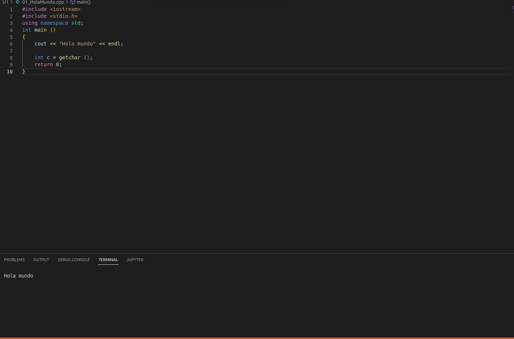
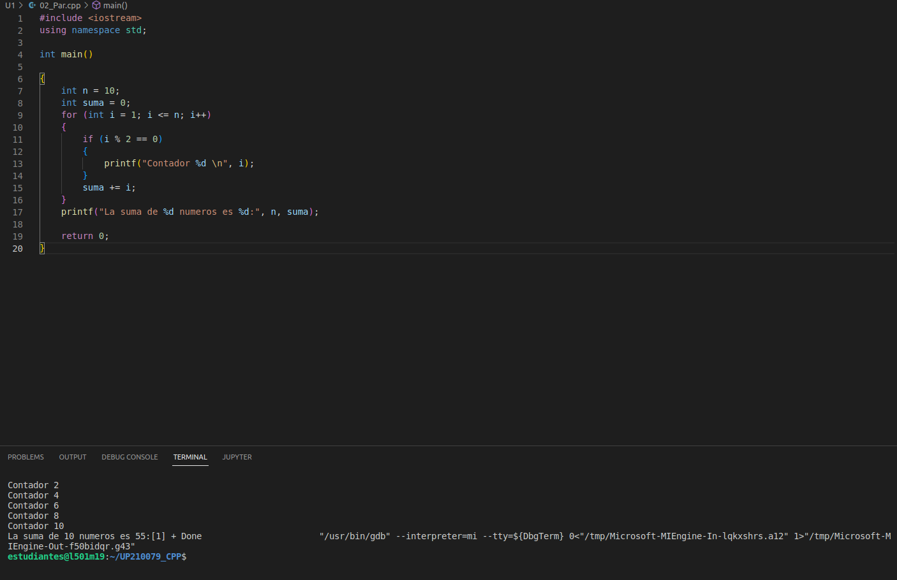
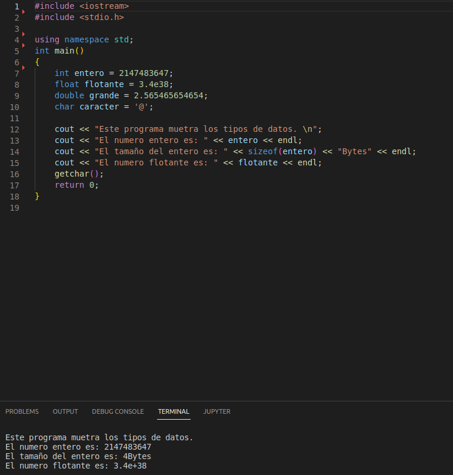
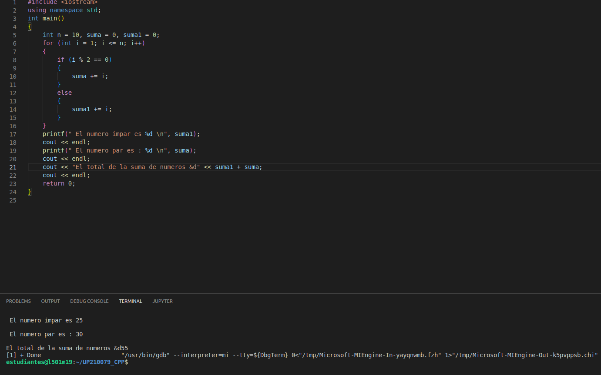
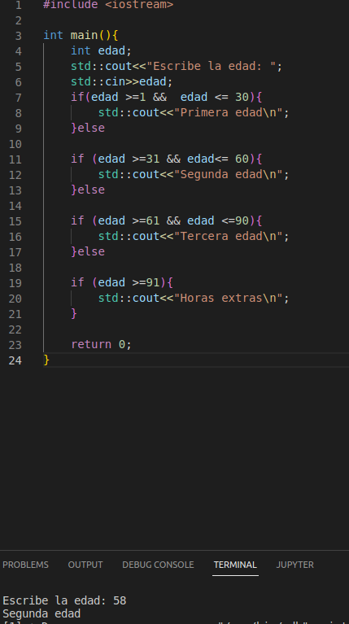

<center>

# UP210079_CPP
# **JOSÉ ALBERTO FLORES MARTÍNEZ**

</center>

>UNIDAD 1
***  
 1. Hola Mundo  
 ```
   int main ()  
    {  
    cout << "Hola mundo" << endl;

    int c = getchar ();
    return 0;
    }
```


 2. Par  
```
   int main()

    {
    int n = 10;
    int suma = 0;
    for (int i = 1; i <= n; i++)
    {
        if (i % 2 == 0)
        {
            printf("Contador %d \n", i);
        }
        suma += i;
    }
    printf("La suma de %d numeros es %d:", n, suma);

```

 3. Datos
```
    int entero = 2147483647;
    float flotante = 3.4e38;
    double grande = 2.565465654654;
    char caracter = '@';

    cout << "Este programa muetra los tipos de datos. \n";
    cout << "El numero entero es: " << entero << endl;
    cout << "El tamaño del entero es: " << sizeof(entero) << "Bytes" << endl;
    cout << "El numero flotante es: " << flotante << endl;
    getchar();
    return 0;

``` 

 4. Ciclos
```
   int main()
{
    int n = 10, suma = 0, suma1 = 0;
    for (int i = 1; i <= n; i++)
    {
        if (i % 2 == 0)
        {
            suma += i;
        }
        else
        {
            suma1 += i;
        }
    }
    printf(" El numero impar es %d \n", suma1);
    cout << endl;
    printf(" El numero par es : %d \n", suma);
    cout << endl;
    cout << "El total de la suma de numeros &d" << suma1 + suma;
    cout << endl;
    return 0;
}

```


 5. Edades
```
int main(){
    int edad;
    std::cout<<"Escribe la edad: ";
    std::cin>>edad;
    if(edad >=1 &&  edad <= 30){
        std::cout<<"Primera edad\n";
    }else

    if (edad >=31 && edad<= 60){
        std::cout<<"Segunda edad\n";
    }else

    if (edad >=61 && edad <=90){
        std::cout<<"Tercera edad\n";
    }else

    if (edad >=91){
        std::cout<<"Horas extras\n";
    }

    return 0;
} 

```


</center>


</center>

>>>>>>>                   UP210079