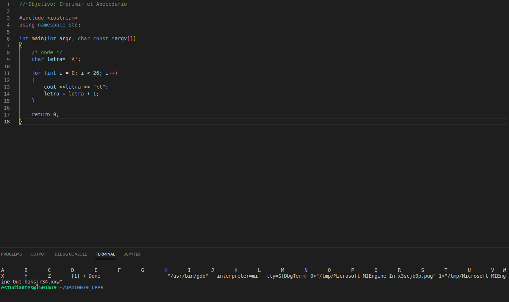
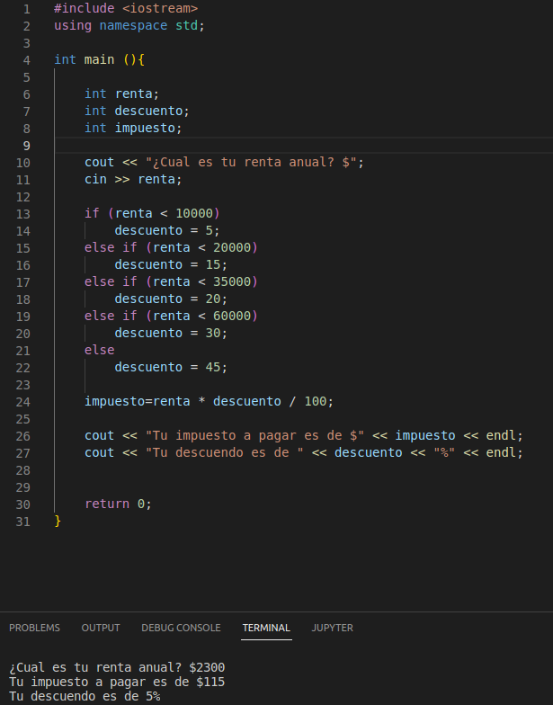
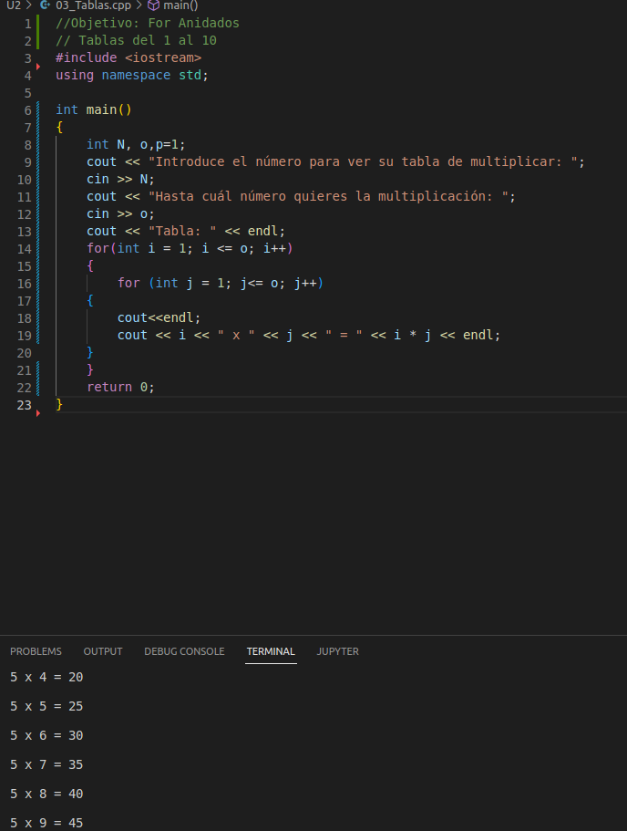

<center>

# UP210079_CPP
# **JOSÉ ALBERTO FLORES MARTÍNEZ**

</center>

>UNIDAD 2
***  
 1. ABC
```
   int main(int argc, char const *argv[])
{
    char letra= 'A';

    for (int i = 0; i < 26; i++)
    {
        cout <<letra << "\t";
        letra = letra + 1;
    }

    return 0;
}
```


 2. Renta
```
int main (){

    int renta;
    int descuento;
    int impuesto;

    cout << "¿Cual es tu renta anual? $";
    cin >> renta;
    
    if (renta < 10000)
        descuento = 5;
    else if (renta < 20000)
        descuento = 15;
    else if (renta < 35000)
        descuento = 20;
    else if (renta < 60000)
        descuento = 30;
    else
        descuento = 45;

    impuesto=renta * descuento / 100;
    
    cout << "Tu impuesto a pagar es de $" << impuesto << endl;
    cout << "Tu descuendo es de " << descuento << "%" << endl;


    return 0;
}

```


 3. Tablas
```
int main()
{
    int N, o,p=1;
    cout << "Introduce el número para ver su tabla de multiplicar: ";
    cin >> N;
    cout << "Hasta cuál número quieres la multiplicación: ";
    cin >> o;
    cout << "Tabla: " << endl;
    for(int i = 1; i <= o; i++)
    {
        for (int j = 1; j<= o; j++)
    {
        cout<<endl;
        cout << i << " x " << j << " = " << i * j << endl;
    }
    }
    return 0;
}

```


 4. Beneficios
```
int main (){
    double punto;
    double monto = 2400;
    double beneficio = 0;

    cout << "Dame tu cantidad de puntos";
    cin >> punto;

    if(punto == 0.0){
        cout << "Tu nivel es invalido \n";
        beneficio = monto * punto;
            cout << "Tu beneficio es: $" << beneficio << endl;

    }
    else if (punto == 0.4){
        cout << "Tu nivel es valido \n";
        beneficio = monto * punto;
            cout << "Tu beneficio es: $" << beneficio << endl;
    }
    else if (punto > 1){
        cout << "Ingresa una cantidad valida" << endl;
    }

    else if (punto >= 0.6){
        cout << "Tu cantidad es: \n";
         beneficio = monto * punto;
             cout << "Tu beneficio es: $" << beneficio << endl;
    }

    else {
        cout << "Ingresa una cantidad valida" << endl;
    }

return 0;
}

```

</center>


</center>

>>>>>>>                   UP210079