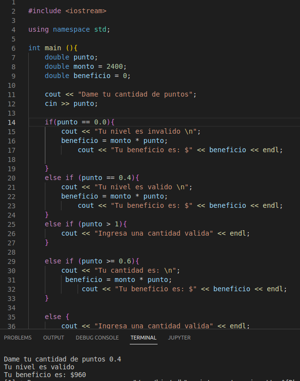
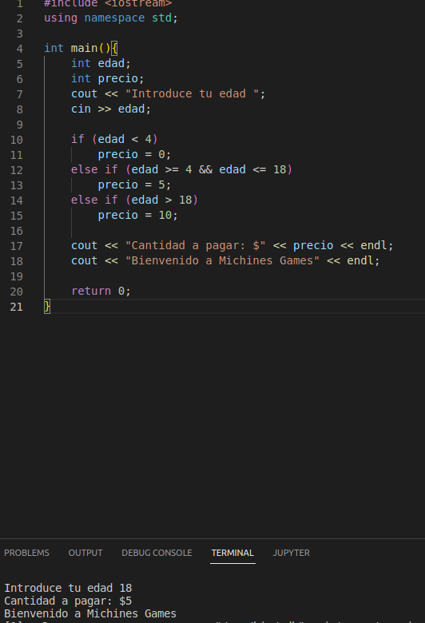
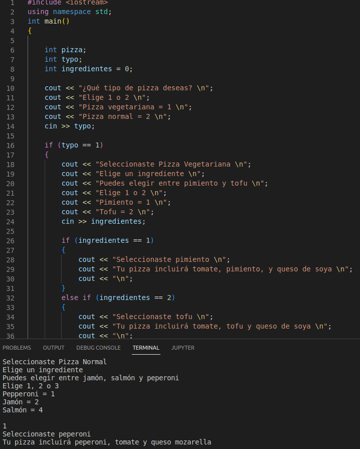
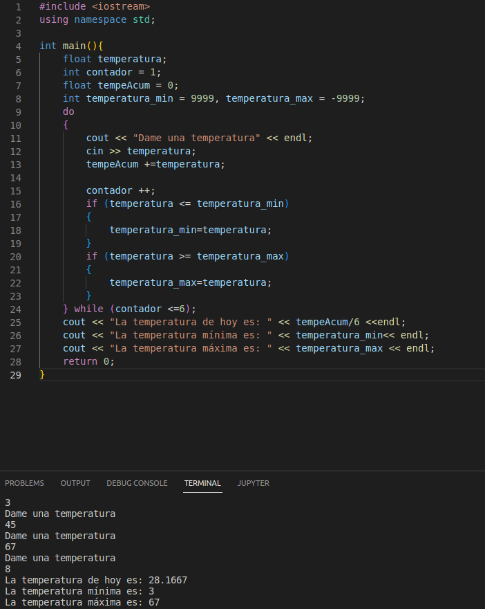
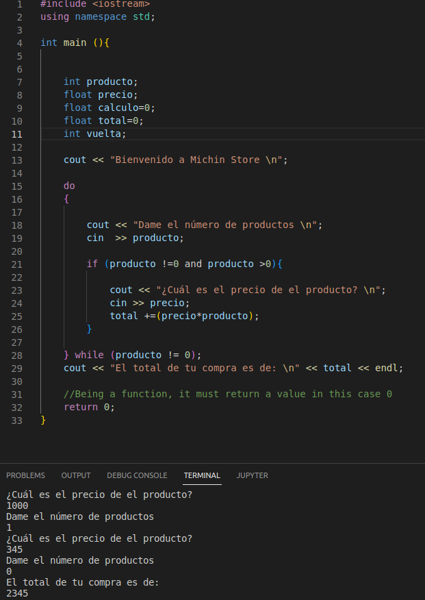
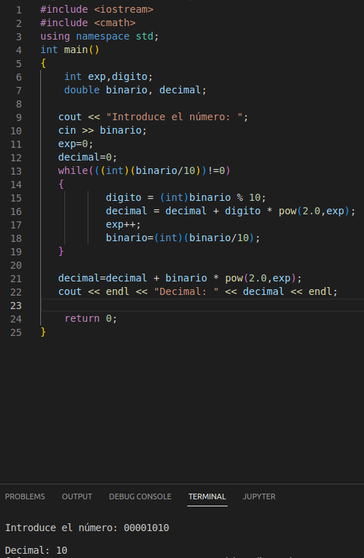

<center>

# UP210079_CPP
# **JOSÉ ALBERTO FLORES MARTÍNEZ**

</center>

>UNIDAD 2
***  
 1. [ABC](https://github.com/UP210079/UP210079_CPP/blob/main/U2/01_ABC.cpp)

```
   int main(int argc, char const *argv[])
{
    char letra= 'A';

    for (int i = 0; i < 26; i++)
    {
        cout <<letra << "\t";
        letra = letra + 1;
    }

    return 0;
}
```


 2. [Renta](https://github.com/UP210079/UP210079_CPP/blob/main/U2/02_renta.cpp)

```
int main (){

    int renta;
    int descuento;
    int impuesto;

    cout << "¿Cual es tu renta anual? $";
    cin >> renta;
    
    if (renta < 10000)
        descuento = 5;
    else if (renta < 20000)
        descuento = 15;
    else if (renta < 35000)
        descuento = 20;
    else if (renta < 60000)
        descuento = 30;
    else
        descuento = 45;

    impuesto=renta * descuento / 100;
    
    cout << "Tu impuesto a pagar es de $" << impuesto << endl;
    cout << "Tu descuendo es de " << descuento << "%" << endl;


    return 0;
}

```


 3. [Tablas](https://github.com/UP210079/UP210079_CPP/blob/main/U2/03_Tablas.cpp)

```
int main()
{
    int N, o,p=1;
    cout << "Introduce el número para ver su tabla de multiplicar: ";
    cin >> N;
    cout << "Hasta cuál número quieres la multiplicación: ";
    cin >> o;
    cout << "Tabla: " << endl;
    for(int i = 1; i <= o; i++)
    {
        for (int j = 1; j<= o; j++)
    {
        cout<<endl;
        cout << i << " x " << j << " = " << i * j << endl;
    }
    }
    return 0;
}

```


 4. [Beneficios](https://github.com/UP210079/UP210079_CPP/blob/main/U2/04_Beneficios.cpp)

```
int main (){
    double punto;
    double monto = 2400;
    double beneficio = 0;

    cout << "Dame tu cantidad de puntos";
    cin >> punto;

    if(punto == 0.0){
        cout << "Tu nivel es invalido \n";
        beneficio = monto * punto;
            cout << "Tu beneficio es: $" << beneficio << endl;

    }
    else if (punto == 0.4){
        cout << "Tu nivel es valido \n";
        beneficio = monto * punto;
            cout << "Tu beneficio es: $" << beneficio << endl;
    }
    else if (punto > 1){
        cout << "Ingresa una cantidad valida" << endl;
    }

    else if (punto >= 0.6){
        cout << "Tu cantidad es: \n";
         beneficio = monto * punto;
             cout << "Tu beneficio es: $" << beneficio << endl;
    }

    else {
        cout << "Ingresa una cantidad valida" << endl;
    }

return 0;
}

```


 5. [Juegos](https://github.com/UP210079/UP210079_CPP/blob/main/U2/05_Juegos.cpp)
   
```

int main(){
    int edad;
    int precio;
    cout << "Introduce tu edad ";
    cin >> edad;

    if (edad < 4)
        precio = 0;  
    else if (edad >= 4 && edad <= 18)
        precio = 5;
    else if (edad > 18)
        precio = 10;

    cout << "Cantidad a pagar: $" << precio << endl;
    cout << "Bienvenido a Michines Games" << endl;

    return 0;
}

```


 6. [Pizza](https://github.com/UP210079/UP210079_CPP/blob/main/U2/06_Pizza.cpp)

```

int main()
{

    int pizza;
    int typo;
    int ingredientes = 0;

    cout << "¿Qué tipo de pizza deseas? \n";
    cout << "Elige 1 o 2 \n";
    cout << "Pizza vegetariana = 1 \n";
    cout << "Pizza normal = 2 \n";
    cin >> typo;

    if (typo == 1)
    {
        cout << "Seleccionaste Pizza Vegetariana \n";
        cout << "Elige un ingrediente \n";
        cout << "Puedes elegir entre pimiento y tofu \n";
        cout << "Elige 1 o 2 \n";
        cout << "Pimiento = 1 \n";
        cout << "Tofu = 2 \n";
        cin >> ingredientes;

        if (ingredientes == 1)
        {
            cout << "Seleccionaste pimiento \n";
            cout << "Tu pizza incluirá tomate, pimiento, y queso de soya \n";
            cout << "\n";
        }
        else if (ingredientes == 2)
        {
            cout << "Seleccionaste tofu \n";
            cout << "Tu pizza incluirá tomate, tofu y queso de soya \n";
            cout << "\n";
        }
    }

    if (typo == 2)
    {
        cout << "Seleccionaste Pizza Normal \n";
        cout << "Elige un ingrediente \n";
        cout << "Puedes elegir entre jamón, salmón y peperoni \n";
        cout << "Elige 1, 2 o 3 \n";
        cout << "Pepperoni = 1 \n";
        cout << "Jamón = 2 \n";
        cout << "Salmón = 4 \n";
        cout << "\n";
        cin >> ingredientes;

        if (ingredientes == 1)
        {
            cout << "Seleccionaste peperoni \n";
            cout << "Tu pizza incluirá peperoni, tomate y queso mozarella \n";
            cout << "\n";
        }
        else if (ingredientes == 2)
        {
            cout << "Seleccionaste jamón \n";
            cout << "Tu pizza incluirá jamón, tomate y queso mozarella \n";
            cout << "\n";
        }
        else if (ingredientes == 3)
        {
            cout << "Seleccionaste salmón \n";
            cout << "Tu pizza incluirá salmón, tomate y queso mozarella \n";
            cout << "\n";
        }
    }

    cout << "Tu pizza estará lista pronto \n";
    cout << "Gracias por visitar Michin Pizzeria";
    cout << "\n";
    cout << "\n";
    cout << "\n";

    return 0;
}

```


 7. [Temperatura](https://github.com/UP210079/UP210079_CPP/blob/main/U2/07_Temperatura.cpp)

```

int main(){
    float temperatura;
    int contador = 1;
    float tempeAcum = 0;
    int temperatura_min = 9999, temperatura_max = -9999;
    do
    {
        cout << "Dame una temperatura" << endl;
        cin >> temperatura;
        tempeAcum +=temperatura;

        contador ++;
        if (temperatura <= temperatura_min)
        {
            temperatura_min=temperatura;
        }
        if (temperatura >= temperatura_max)
        {
            temperatura_max=temperatura;
        }
    } while (contador <=6);
    cout << "La temperatura de hoy es: " << tempeAcum/6 <<endl;
    cout << "La temperatura mínima es: " << temperatura_min<< endl;
    cout << "La temperatura máxima es: " << temperatura_max << endl;
    return 0;
}

```


 8. [Precios](https://github.com/UP210079/UP210079_CPP/blob/main/U2/08_Precios.cpp)

```

int main (){


    int producto;
    float precio;
    float calculo=0;
    float total=0;
    int vuelta;

    cout << "Bienvenido a Michin Store \n";

    do
    {
        
        cout << "Dame el número de productos \n";
        cin  >> producto;

        if (producto !=0 and producto >0){

            cout << "¿Cuál es el precio de el producto? \n";
            cin >> precio;
            total +=(precio*producto);
        }

    } while (producto != 0);
    cout << "El total de tu compra es de: \n" << total << endl;

    return 0;
}

```


9. [BinarioADecimal](https://github.com/UP210079/UP210079_CPP/blob/main/U2/09_BinarioADecimal.cpp)

```

int main()
{
    int exp,digito;
    double binario, decimal;

   cout << "Introduce el número: ";
   cin >> binario;
   exp=0;
   decimal=0;
   while(((int)(binario/10))!=0)
   {
           digito = (int)binario % 10;
           decimal = decimal + digito * pow(2.0,exp);
           exp++;
           binario=(int)(binario/10);
   }

   decimal=decimal + binario * pow(2.0,exp);
   cout << endl << "Decimal: " << decimal << endl;
   
    return 0;
}

```


</center>


</center>

>>>>>>>                   UP210079