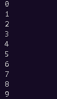

<center>

# UP210079_CPP
# **JOSÉ ALBERTO FLORES MARTÍNEZ**

</center>

>UNIDAD 3
***  
 1. [Bisección](https://github.com/UP210079/UP210079_CPP/blob/main/U3/01_Biseccion.cpp)

```
double fnEcuacion1(double x)
{
    return (pow(x, 2) - 8*x + 15);
}
int main()
{
    double x1 = -10;
    double x2 = 4.5;
    double xPromedio;

    double ErrorEstandar = .00001;
    double ErrorRelativo = abs(x2 - x1); 
    int i = 1;
    while (ErrorRelativo > ErrorEstandar)
    {
        xPromedio = (x1 + x2)/2;
        if (fnEcuacion1(x1) * fnEcuacion1(xPromedio) < 0)
        {
            x2 = xPromedio;
        
        } 
        else 
        {
            x1 = xPromedio;
        }
        ErrorRelativo = abs(x2 - x1);
        i = i + 1;
    }
    cout << "i = " << i << "\nraiz = " << xPromedio << endl;
    cout << "...Hecho :)";
    return 0;
    
```


 2. [Grados a Radianes](https://github.com/UP210079/UP210079_CPP/blob/main/U3/02_GradosARadianes.cpp)

```

int main( )
{
        float grados,rad;
 
        printf("Introduce los grados");
        scanf("%f",&grados);
        rad=grados*2*PI/360;
        printf("%f grados son: %f radianes",grados,rad);
 
    system("pause");
    return 0;
}

```


 3. [Año Bisiesto](https://github.com/UP210079/UP210079_CPP/blob/main/U3/03_A%C3%B1oBIsiesto.cpp)
```
int main(){
      int a;
      cout<<"Ingresa año"<<endl;
      cin>>a;
     if(a % 4 == 0 && (a % 100 != 0 || a % 400 == 0)){
         cout<<"El año "<<a<<" Si es bisiesto ";
     }else{
         cout<<"El año "<<a<<" No es bisiesto ";
     }
      return 0;
}

```


 4. [Coseno](https://github.com/UP210079/UP210079_CPP/blob/main/U3/04_Coseno.cpp)

```
const double pi = std::acos(-1);

int main() {

    cout << "cos(pi) = " << std::cos(pi) << '\n'
         << "cos(pi/6) = " << std::cos(pi/6) << '\n'
         << "cos(pi/4) = " << std::cos(pi/4) << '\n'
         << "cos(pi/3) = " << std::cos(pi/3) << '\n'
         << "cos(pi/2) = " << std::cos(pi/2) << '\n'
         << "cos(+0) = " << std::cos(0.0) << '\n'
         << "cos(-0) = " << std::cos(-0.0) << '\n';

    return EXIT_SUCCESS;
}


```


 5. [Desgloce](https://github.com/UP210079/UP210079_CPP/blob/main/U3/05_DesgloceDeMoneda.cpp)

```
int main(){
    int dinero =8358, i=0;
    int cambio[10]={1000,500,200,100,50,20,10,5,2,1};
    while (dinero>0)
    {
        if (dinero>=cambio[i])
        {
            cout<<dinero/cambio[i]<< " billetes de  " <<cambio[i]<<endl;
            dinero=dinero%cambio[i];
        }
        i++;
    }
    return 0;
  
 ```
 
 
 
   6. [Numeros Romanos](https://github.com/UP210079/UP210079_CPP/blob/main/U3/06_NumerosRomanos.cpp)
   
```

int main(){
    int n=2003;
    int v;
    int romanos[]={1000,900,500,400,100,90,50,40,10,9,5,4,1};
    string NR[]={"M","CM","D","CD","C","XC","L","XL","X","IX","V","IV","I"};
    string numero="";
    int i=0;
    while(n>0)
    {
        if (n>=romanos[i])
        {
            v=n/romanos[i];
            n=n%romanos[i];
            for (int j = 0; j < v; j++)
            {
                numero=numero+NR[i];
            }
        }
        i++;
    }
    cout<<numero;
    return 0;
  
 ```
 
 
 
 7. [RFC](https://github.com/UP210079/UP210079_CPP/blob/main/U3/07_RFC.cpp)
 
 ```


int main(){
    string nombre="Carlos";
    string AP="Esparza";
    string AM="Lopez";
    string fe="17/11/2022";
    string rfc="";
    int v=nombre.length(); 
    int p=0;
    
    rfc=rfc+AP[0];
    for (int i = 1; i < v && p<1; i++)
    {
        if (AP[i]=='a' || AP[i]=='e' || AP[i]=='i' || AP[i]=='o' || AP[i]=='u' )
        {
            rfc=rfc+AP[i];
            p++;
        }  
    }

    int d1=fe.find_last_of("/");
    int d2=fe.find("/");
    rfc=rfc+AM[0]+nombre[0]+fe.substr(d1+1,4)+fe.substr(d2+1,2)+fe.substr(0,2);
    
    v=rfc.length();
    for (int i = 0; i < v; i++)
    {
        rfc[i]=toupper(rfc[i]);
    }
    cout<<nombre<<" RFC: "<<rfc;
    return 0;
    
 ```
  
  
  
  8. [Vector](https://github.com/UP210079/UP210079_CPP/blob/main/U3/08_OrdenarVector.cpp)
 
 ```
void Ordenar(int x[],int v){
    int m,s,c;
    do{
        c=0;
        for (int i = 0; i < v; i++)
        {
            s=i+1;
            if (x[i]>x[s])
            {
                m=x[s]; x[s]=x[i]; x[i]=m;
                c++;
            }   
        }
        
    } while(c>0);
}

int main(){
    int c[]={9,8,7,6,5,4,3,2,1,0};
    int n=sizeof(c)/4;
    Ordenar(c,n);
    for (int i = 0; i < n; i++)
    {
        cout<<c[i]<<endl;
    }
    return 0;
    
 ```
  
  
  
   9. [FuncionRecursiva](https://github.com/UP210079/UP210079_CPP/blob/main/U3/09_FuncionRecursiva.cpp)
  
   ```

double factorial(int numero){
    if (numero == 1){
        return 1;
    }else{
        return numero*factorial(numero-1);
    }
}

int main(){
    int n=6, f;
    f=factorial(n);
    cout<<"El factorial de "<<n<<" es "<<f;
    
 ```
   
   
  
</center>


</center>

>>>>>>>                   UP210079
